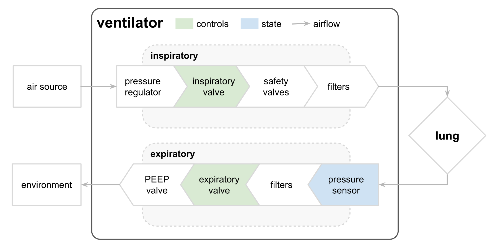
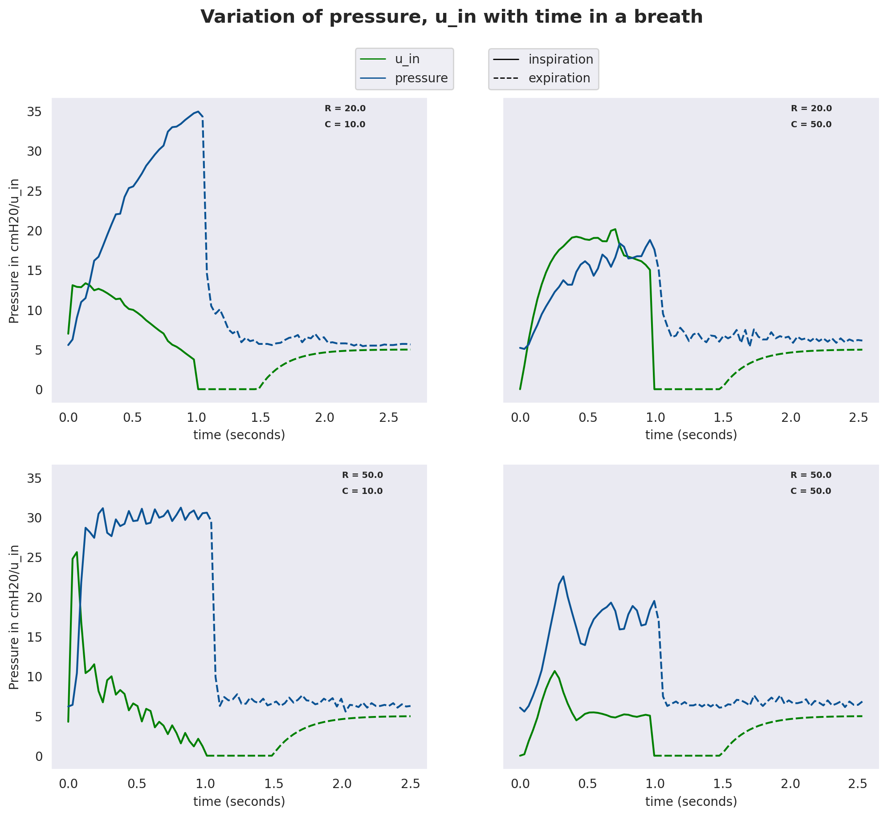
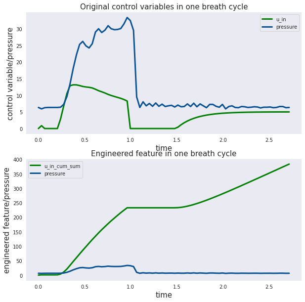
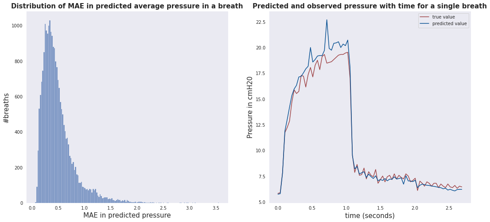
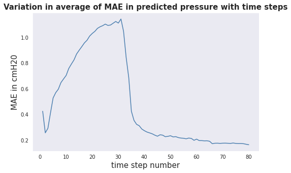

# Ventilator Pressure Prediction 

## Contents

1. [Introduction](#Introduction)
2. [Goal](#Goal)
3. [Data Description](#Data-Description) 
4. [Data Cleaning and EDA](#Data-Cleaning-and-EDA)
5. [Feature Engineering and Modeling](#Feature-Engineering-and-Modeling)
6. [Model Performance](#Model-Performance)
7. [Conclusions and TODO](#Conclusions-and-TODO)

## Introduction

The current project involves using machine learning models to predict airway pressure in the respiratory circuit of an  [open source ventilator](#https://www.peoplesvent.org/en/latest/) attached to an [artificial test lung](#https://www.ingmarmed.com/product/quicklung/). This section includes a high level overview of the workings of the open source ventilator

### PVP - The People's Ventilator Project 

The global COVID-19 pandemic has highlighted the need for a low-cost, rapidly-deployable ventilator, for the current as well as future respiratory virus outbreaks. While safe and robust ventilation technology exists in the commercial sector, the small number of capable suppliers cannot meet the severe demands for ventilators during a pandemic. Moreover, the specialized, proprietary equipment developed by medical device manufacturers is expensive and inaccessible in low-resource areas.

The [People’s Ventilator Project (PVP)](https://www.peoplesvent.org/en/latest/) is an open-source, low-cost pressure-control ventilator designed for minimal reliance on specialized medical parts to better adapt to supply chain shortages. This is a project funded and supported by the Princeton University.

Note: As per the team that designed the PVP, it is not a regulated or clinically validated medical device. It is currently recommended only for research purposes.

- [source 1: PVP homepage](https://www.peoplesvent.org/en/latest/)
- [source 2: medRxiv Preprint](./research/medRxiv_preprint.pdf)

### The Setup

The diagram below [(source)](https://www.kaggle.com/c/ventilator-pressure-prediction/data) illustrates the setup.  There are two control inputs that are highlighted in green. The state variable (airway pressure) to predict is in blue. 

The first control input is a continuous variable from 0 to 100 representing the percentage the inspiratory valve is open to let air into the lung (i.e., 0 is completely closed and no air is let in and 100 is completely open). The second control input is a binary variable representing whether the expiratory valve is open (1) or closed (0) to let air out.

## Goal

The goal is to predict the airway pressure in the respiratory circuit and minimize the mean absolute error. This prediction will be used as an input to inform modifications to the design of the respiratory circuit
 

## Data Description

The [data](https://www.kaggle.com/c/ventilator-pressure-prediction/data) is available for download from the webpage of an open competition hosted on Kaggle. 

The dataset contains more than 75000 time series of breaths. Each time series represents a 3 second breath and has the values of the control variables (`u_in`, percentage the inspiratory valve is open to let air in and  `u_out`, a binary variable indicating if the expiratory valve is open) and the `pressure`, the airway pressure at 80 timestamps between 1 to 3 seconds. In addition to this, the values of two lung attributes - resistance(`R`) and compliance(`C`) are also available for each breath. 

Here is a complete [data dictionary](https://www.kaggle.com/c/ventilator-pressure-prediction/data):

- `id` - globally-unique row identifier across an entire file
- `breath_id` - globally-unique identifier for breaths
- `R` - lung attribute indicating how restricted the airway is (in cmH2O/L/S). Physically, this is the change in pressure per change in flow (air volume per time). Intuitively, one can imagine blowing up a balloon through a straw. We can change R by changing the diameter of the straw, with higher R being harder to blow. Either 5, 20 or 50
- `C` - lung attribute indicating how compliant the lung is (in mL/cmH2O). Physically, this is the change in volume per change in pressure. Intuitively, one can imagine the same balloon example. We can change C by changing the thickness of the balloon’s latex, with higher C having thinner latex and easier to blow. Either 10, 20 or 50
- `time_step` - the actual time stamp.
- `u_in` - the control input for the inspiratory solenoid valve. Ranges from 0 to 100.
- `u_out` - the control input for the exploratory solenoid valve. Either 0 or 1.
- `pressure` - the airway pressure measured in the respiratory circuit, in cmH2O.

## Data Cleaning and EDA

### Data Cleaning

There were a small number of rows (~ 0.0005%) which had negative `pressure` values. The data was cleaned by dropping any breath (entire time series corresponding to a single 3s breath) if it had even one row with negative pressure. This led to dropping of 73 (of more than 75000) breaths but still retaining more than 99.9% of the original raw data. The details of this cleaning and EDA can be found in this  [notebook](./code/EDA.ipynb) 

### EDA - Analyzing single breaths

EDA involved analyzing the distributions of the target variable, `pressure` and the control variables and the correlations between them.

The interesting aspect of the EDA involved exploring the time series of each breath. Each breath has an inspiratory phase where the airway pressure increases, reaches a peak inspiratory pressure (PIP) and the pressure decreses during the expiratory phase. The following are the visualisations of airway pressure for a sample of four different breath time series along with the values of the control variables (`u_in` and `u_out`)

## Feature Engineering and Modeling

The approach taken to predicting the airway pressure was to use tree based models with various 'breath_level' features.

For each breath time series, the following features were engineered and the details can be found in this [notebook](./code/Feature_engineering.ipynb):

- Cumulative sum of `u_in` and `u_out`
- Average of `u_in` and `u_out`
- Rolling sum (over 2 time steps) of u_in and u_out
- Lags (over 1 and 2 time steps) of u_in and u_out
- Difference in the time steps
- Polynomial interaction features between `u_in` and `time_step` for various powers of the variables.

Several tree based models (Random forest regressor and gradient boosting regressor) were fitted to tune the hyperparameters of the models and also the powers of the polynomial features and the duration of the rolling sums. Complete details of hyperparameter tuning can be found in this [notebook](./code/basic_models.ipynb) and [here](https://colab.research.google.com/drive/19GGYh31rs1gg7vgO2W0P33-fYZrcNDUy)

## Model Performance

The table below summarizes the performance of the various models as measured by the mean absolute error in `pressure`

|                                                       | Mean absolute error in pressure (cmH20) |           |
|:-----------------------------------------------------:|:---------------------------------------:|:---------:|
|                                                       |              Training data              | Test data |
|                       Null model                      |                   6.22                  |    6.18   |
| Random forest regressor (without engineered features) |                   2.05                  |    2.08   |
|   Random forest regressor (with engineered features)  |                   0.36                  |    0.49   |
|              Gradient boosting regressor              |                   0.14                  |    0.45   |

### Error Analysis

The following analysis in performed on the predictions of the best performing random forest regressor on the test set. The details of this analysis can be found in this [notebook](./code/predictions_and_error_analysis.ipynb). The figures below show the distribution of average MAE by breath and the predictions for a single sample breath.The MAE during the inspiration phase (0.84) is much higher than the MAE during the expiration phase (0.27).

The MAE also shows an increasing trend with time during the inspiration phase peaking close to the time when exhalation begins. The figure below shows the variation in the average MAE at a given time step across all breaths

## Conclusions and TODO

- Current recommendation:
    - Use the random forest regressor with a mean absolute error of 0.49  as this model was less over fit than the best performing model and will likely generalize better
- TODO
    - Use the current model to seed the first few pressure values in every new breath cycle and use a time series model to predict the rest
    - Use deep learning techniques such as RNNs which are expected to do well with data that has time dependencies
    - More hyperparameter tuning and feature engineering to reduce the mean absolute error

